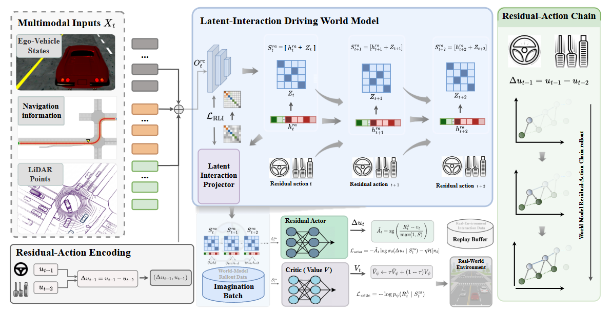
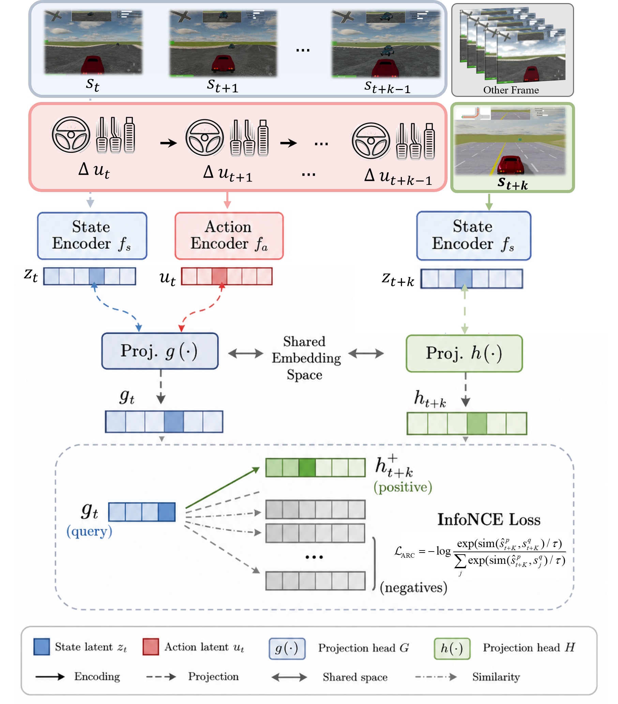
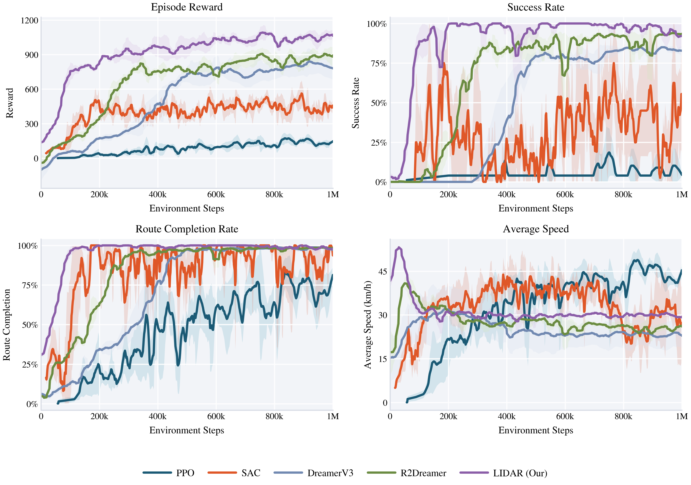
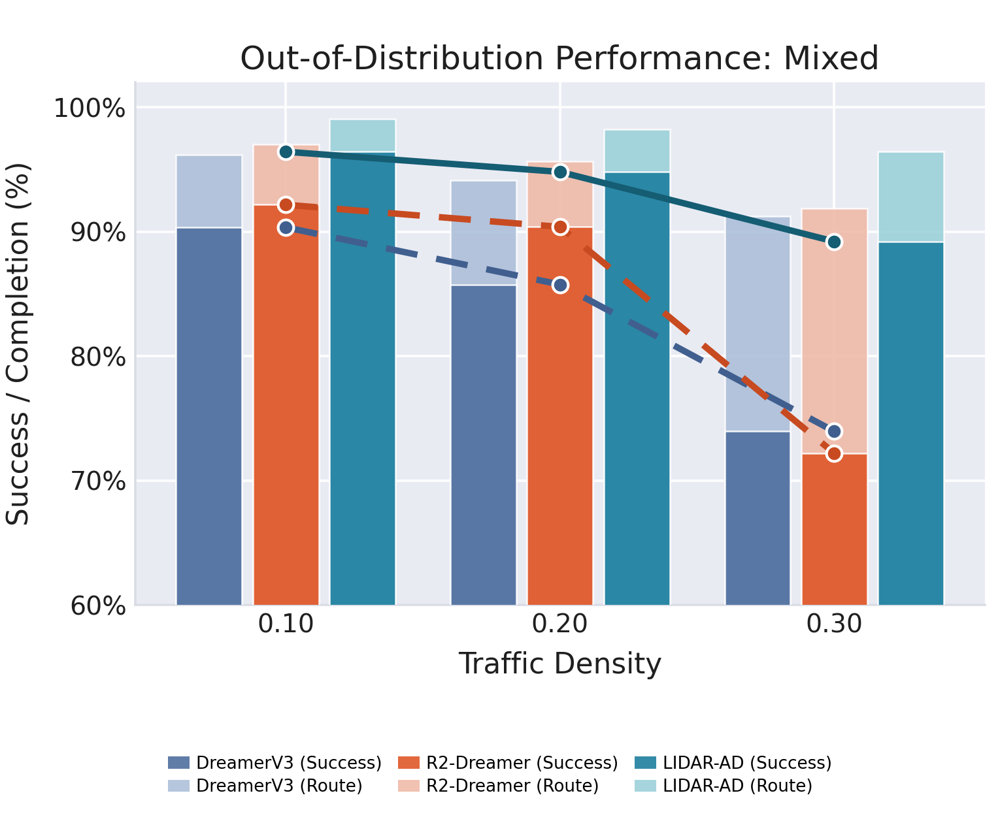
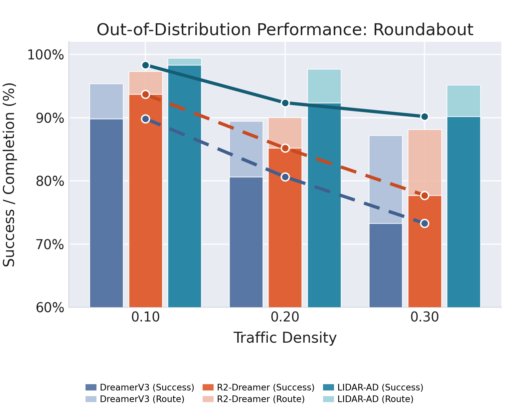
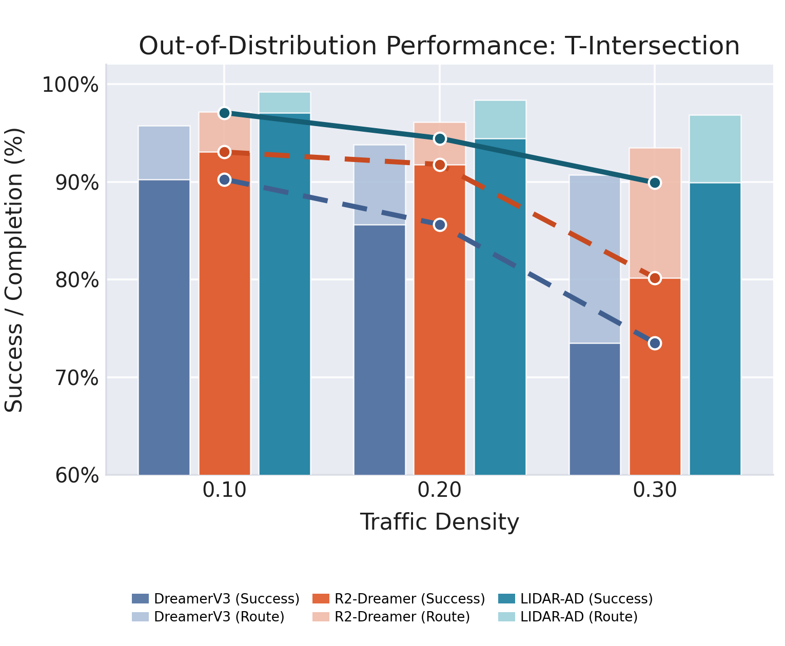
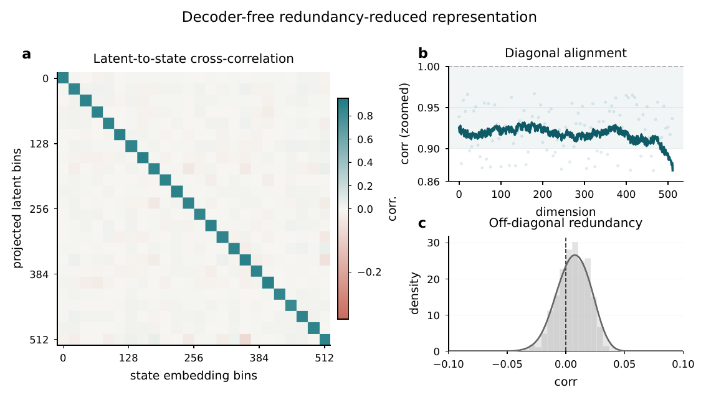
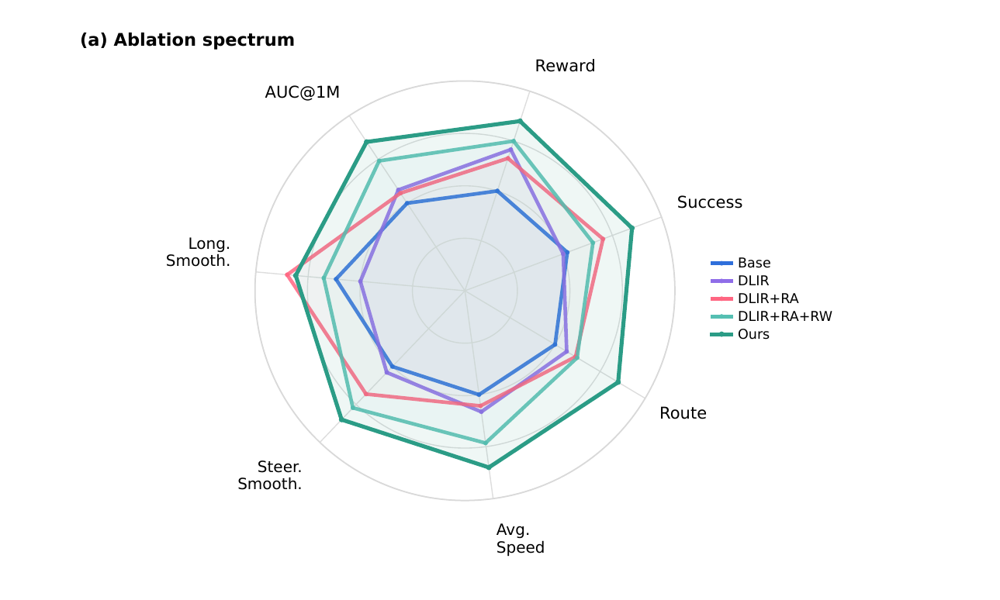
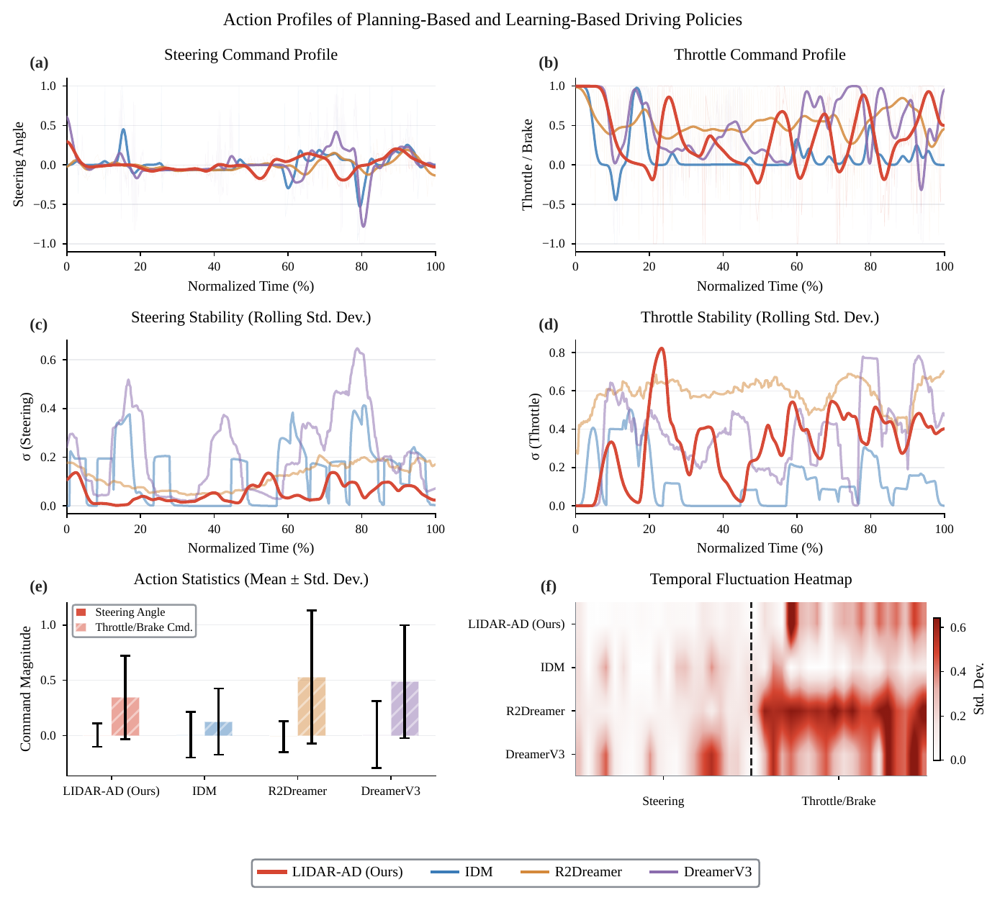
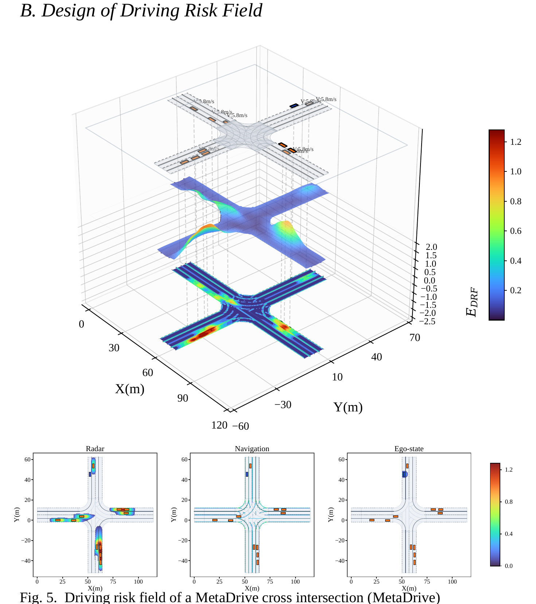

# LIDAR-AD: A Decoder-Free Latent-Interaction Dreamer with Action-Residual Chains for Autonomous Driving

[](https://lumen2023.github.io/lidar-ad-website/)
[]()
[](https://creativecommons.org/licenses/by-sa/4.0/)

**Yongzhi Liu · Jinchang Xu · Zeng Kang · Sunan Zhang · Weichao Zhuang**

School of Mechanical Engineering, Southeast University · Nanjing 211189, China

📧 [yongzhiliu@seu.edu.cn](mailto:yongzhiliu@seu.edu.cn) · [wezhuang@seu.edu.cn](mailto:wezhuang@seu.edu.cn) (Corresponding)

> 🏷️ **Under Review** — IEEE Transactions on Knowledge and Data Engineering (TKDE)

---

## 📄 Abstract

Autonomous driving requires long-horizon closed-loop decision making in highly dynamic traffic environments. Latent world models offer an effective framework by enabling imagination-based planning in compact latent spaces. However, multi-source driving observations contain substantial control-irrelevant redundancy, while reliable decisions depend on risk-relevant relations and future dynamics. Moreover, vehicle control evolves continuously and incrementally, requiring models to capture action adjustments and their multi-step consequences.

We propose **LIDAR-AD** — a decoder-free latent-interaction Dreamer with **residual-action chains**. Instead of reconstructing observations, LIDAR-AD learns compact latent representations through **de-redundancy alignment**, focusing on risk-relevant interactions across multi-source driving inputs. To better capture control continuity, LIDAR-AD formulates policy outputs as **residual action updates** with a **residual-action chain contrastive learning** objective, extracting temporal dependencies for multi-step continuous decision making.

Extensive experiments across diverse simulated driving scenarios demonstrate that LIDAR-AD consistently and significantly outperforms strong world-model baselines, achieving the highest reward and best success rates among learning-based methods. Evaluation on the nuPlan benchmark further validates the method's effectiveness on real-world driving data.

---

## 🔑 Contributions

1. **Decoder-Free Latent-Interaction Representation (DLIR)** — Eliminates observation reconstruction by structuring multi-source observations (ego-vehicle state, LiDAR point clouds, navigation maps) into interaction-aware latent representations via gated fusion and de-redundancy alignment.

2. **Residual Action World Model (RAWM)** — Reformulates the policy as residual updates rather than absolute actions, with joint action embeddings that capture both current actions and their adjustments.

3. **Action-Residual Chain Contrastive Learning (ARC-CL)** — Introduces K-step action chain contrastive learning that constrains the prior rollout dynamics using future action sequences as positive pairs.

---

## 🧠 Method

### Overall Framework

<p align="center">
  
</p>

LIDAR-AD unifies three modules around a shared RSSM state $s_t = (h_t, z_t)$:

| Module | Role |
|--------|------|
| **DLIR** | Encodes heterogeneous observations into risk-aware latent representations **without reconstruction** |
| **RAWM** | Models continuous control as **residual adjustments** with joint action embeddings |
| **ARC-CL** | Enforces multi-step temporal consistency via **contrastive learning over action chains** |

### DLIR — De-Redundancy Alignment

<p align="center">
  
</p>

Instead of reconstructing raw observations, DLIR explicitly models interactions among three heterogeneous observation streams:

1. **Group-wise encoding** — Ego state, LiDAR point clouds, and navigation maps encoded separately
2. **Cross-modal interaction** — Pairwise attention captures inter-modality relations
3. **Scalar gating** — Learnable gates $\alpha_t^k$ adaptively weight each modality
4. **De-redundancy alignment** — Barlow Twins objective eliminates redundant cross-modal information while preserving risk-relevant features

### RAWM — Residual Action Modeling

<p align="center">
  
</p>

RAWM reformulates the policy as residual updates instead of absolute actions:

$$u_t = u_{t-1} + \alpha \cdot \Delta u_t, \quad \Delta u_t \sim \pi_\theta(\cdot \mid s_t, u_{t-1})$$

$$a_t = \tanh(u_t), \quad d_t = E_\text{act}([a_t; \Delta u_t])$$

The **latent-tanh** parameterization represents smooth long-horizon control as compact local updates, consistent with residual action distributions observed in real driving data.

---

## 📊 Results

### Training Dynamics

<p align="center">
  
</p>

LIDAR-AD converges faster and achieves higher final performance than all compared baselines.

### Out-of-Distribution Generalization

<p align="center">
  
  
  
</p>

Strong zero-shot generalization to unseen traffic densities and road layouts across all MetaDrive scenarios.

### Latent Analysis & Ablation

<table>
<tr>
  <td width="33%"><br><em>Barlow Twins representation analysis</em></td>
  <td width="33%"><br><em>Ablation performance spectrum</em></td>
  <td width="33%"><br><em>Smoothness: LIDAR-AD vs baselines</em></td>
</tr>
</table>

### Risk Field Visualization

<p align="center">
  
</p>

Decoder-free representations enable risk-aware scene understanding — learned risk fields adaptively highlight collision-relevant regions.

---

## 🎥 Driving Demonstrations

> 💡 Click each video to play. Visit the [project page](https://lumen2023.github.io/lidar-ad-website/) for interactive comparisons.

### 🚗 MetaDrive — Mixed Traffic

<table>
<tr>
  <td width="33%"><b>LIDAR-AD (Ours)</b></td>
  <td width="33%"><b>Baseline — Case 1</b></td>
  <td width="33%"><b>Baseline — Case 2</b></td>
</tr>
<tr>
  <td><video src="static/videos/metadrive-scene/mixed/LIDAR-AD_seed100_mix_density0.4.mp4" controls muted loop width="100%" preload="metadata"></video></td>
  <td><video src="static/videos/metadrive-scene/mixed/lattice_front_frames_3eds_ep002_seed147.mp4" controls muted loop width="100%" preload="metadata"></video></td>
  <td><video src="static/videos/metadrive-scene/mixed/lattice_front_frames_3eds_ep006_seed139.mp4" controls muted loop width="100%" preload="metadata"></video></td>
</tr>
</table>

### 🔄 MetaDrive — Roundabout

<table>
<tr>
  <td width="33%"><b>Case 1</b></td>
  <td width="33%"><b>Case 2</b></td>
  <td width="33%"><b>Case 3</b></td>
</tr>
<tr>
  <td><video src="static/videos/metadrive-scene/roundout/0.5/ep000_seed1000.mp4" controls muted loop width="100%" preload="metadata"></video></td>
  <td><video src="static/videos/metadrive-scene/roundout/0.5/ep002_seed1002.mp4" controls muted loop width="100%" preload="metadata"></video></td>
  <td><video src="static/videos/metadrive-scene/roundout/0.5/ep003_seed1003.mp4" controls muted loop width="100%" preload="metadata"></video></td>
</tr>
</table>

### ⛔ MetaDrive — T-Intersection

<table>
<tr>
  <td width="33%"><b>Case 1</b></td>
  <td width="33%"><b>Case 2</b></td>
  <td width="33%"><b>Case 3</b></td>
</tr>
<tr>
  <td><video src="static/videos/metadrive-scene/T-intersection/ep000_seed1000.mp4" controls muted loop width="100%" preload="metadata"></video></td>
  <td><video src="static/videos/metadrive-scene/T-intersection/ep002_seed1002.mp4" controls muted loop width="100%" preload="metadata"></video></td>
  <td><video src="static/videos/metadrive-scene/T-intersection/ep005_seed1000.mp4" controls muted loop width="100%" preload="metadata"></video></td>
</tr>
</table>

### 🗺️ nuPlan — Front View

<table>
<tr>
  <td width="33%"><b>Case 1</b></td>
  <td width="33%"><b>Case 2</b></td>
  <td width="33%"><b>Case 3</b></td>
</tr>
<tr>
  <td><video src="static/videos/nuplan/render1/front.mp4" controls muted loop width="100%" preload="metadata"></video></td>
  <td><video src="static/videos/nuplan/render2/front.mp4" controls muted loop width="100%" preload="metadata"></video></td>
  <td><video src="static/videos/nuplan/render3/front.mp4" controls muted loop width="100%" preload="metadata"></video></td>
</tr>
</table>

### 🗺️ nuPlan — BEV

<table>
<tr>
  <td width="33%"><b>Case 1</b></td>
  <td width="33%"><b>Case 2</b></td>
  <td width="33%"><b>Case 3</b></td>
</tr>
<tr>
  <td><video src="static/videos/nuplan/render1/bev.mp4" controls muted loop width="100%" preload="metadata"></video></td>
  <td><video src="static/videos/nuplan/render2/bev.mp4" controls muted loop width="100%" preload="metadata"></video></td>
  <td><video src="static/videos/nuplan/render3/bev.mp4" controls muted loop width="100%" preload="metadata"></video></td>
</tr>
</table>

### ⚡ Risk Field Dynamics

<table>
<tr>
  <td width="33%"><b>Case 1</b></td>
  <td width="33%"><b>Case 2</b></td>
  <td width="33%"><b>Case 3</b></td>
</tr>
<tr>
  <td><video src="static/videos/risk_field/215BDA927CCDA3160BC32E46FB5FC41E.mp4" controls muted loop width="100%" preload="metadata"></video></td>
  <td><video src="static/videos/risk_field/7CB3BFDE3334D633DF36E6764335B96E.mp4" controls muted loop width="100%" preload="metadata"></video></td>
  <td><video src="static/videos/risk_field/B2DD5AD354955C4EBBF863EB99DF52BF.mp4" controls muted loop width="100%" preload="metadata"></video></td>
</tr>
</table>

---

## 🗂️ Project Structure

```
.
├── index.html                         # Main project page
├── static/
│   ├── css/                           # Stylesheets (Bulma, Font Awesome)
│   ├── js/                            # JavaScript (carousel, interactions)
│   ├── images/LIDAR-AD/               # 13 figures & diagrams
│   └── videos/                        # 18 driving demos (MP4)
│       ├── metadrive-scene/           #   mixed / roundabout / T-intersection
│       ├── nuplan/                    #   front-view + BEV
│       └── risk_field/                #   risk field dynamics
└── README.md
```

## 🖥️ Local Development

```bash
python3 -m http.server 8000
# Open http://localhost:8000
```

---

## 📝 Citation

```bibtex
@article{liu2026lidarad,
  title   = {{LIDAR-AD}: A Decoder-Free Latent-Interaction Dreamer
             with Action-Residual Chains for Autonomous Driving},
  author  = {Liu, Yongzhi and Xu, Jinchang and Kang, Zeng
             and Zhang, Sunan and Zhuang, Weichao},
  journal = {IEEE Transactions on Knowledge and Data Engineering},
  note    = {Under Review},
  year    = {2026}
}
```

---

## 📜 License

Project page: [CC BY-SA 4.0](https://creativecommons.org/licenses/by-sa/4.0/). Code & models: to be released separately.

## 🙏 Acknowledgments

Template adapted from [Academic Project Page Template](https://github.com/eliahuhorwitz/Academic-project-page-template) and [Nerfies](https://nerfies.github.io/).
